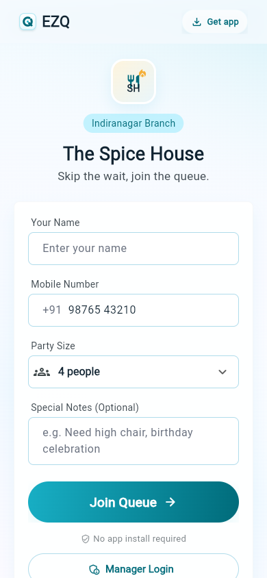
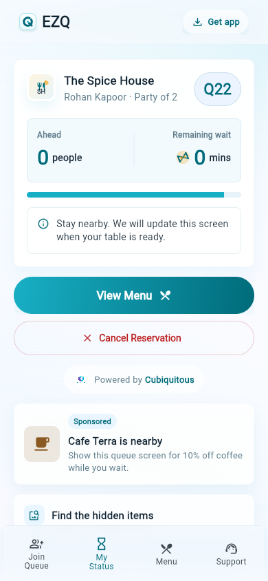
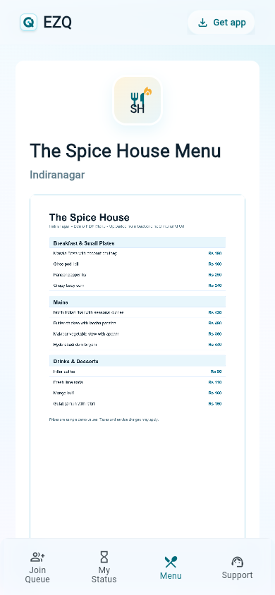
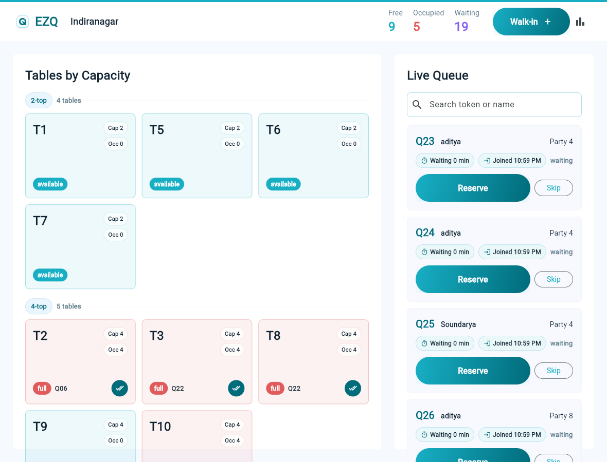

# EZQ UI Design Handout

Last updated: June 30, 2026

## 1. Product Experience

EZQ is a mobile-first restaurant queue management experience for two audiences:

- Customers: join a queue from a QR/web link, track their place, see remaining wait, view the uploaded menu PDF, use support, and stay engaged while waiting.
- Managers: view table availability, seat the right table for a party, monitor wait duration, finish meals, and track table lifecycle timestamps.

The design direction is clean, calm, and iOS-inspired: high clarity, restrained surfaces, soft depth, compact spacing, large touch targets, and a small number of meaningful status colors.

## 2. Current UI Screenshots

These screenshots are captured from the deployed Firebase web app and should be used as the current visual reference for Figma, QA, and future UI work.

### Customer Join Queue

The customer entry screen is phone-first, QR-friendly, and optimized for fast queue submission without account creation.

### Customer Queue Status

The status screen shows token, party details, queue position, remaining wait, menu access, cancellation, powered-by branding, sponsored ad space, and the waiting puzzle module.

### Customer Menu

The menu screen is a PDF viewer surface backed by the restaurant-uploaded menu document. The pending state appears when no PDF is uploaded.

### Manager Dashboard

The manager dashboard uses a capacity-first table grid and a live queue panel. Queue cards show wait duration and joined time so managers understand how long each party has been waiting.

## 3. Brand Direction

### Visual Personality

- Elegant, lightweight, and operational.
- Uses white, pale blue, mint, aqua, and teal as the core visual language.
- Avoids heavy decorative graphics in manager workflows.
- Uses motion and playful modules only in customer wait contexts.

### Logo System

- Product mark: compact rounded square with a queue-inspired Q mark.
- Parent brand: Cubiquitous appears in powered-by placements with the company logo.
- Admin header: EZQ product mark, branch name, live metrics, walk-in action, reports icon.
- Customer header: EZQ product mark, download app shortcut, glass-style top bar.

## 4. Color System

### Brand Palette

| Token | Hex | Use |
| --- | --- | --- |
| Cubiquitous Mint | `#CDFFD8` | Soft progress, gentle backgrounds |
| Cubiquitous Aqua | `#B0DCEB` | Borders, dividers, soft surfaces |
| Cubiquitous Sky | `#94B9FF` | Subtle progress and secondary accents |
| Tracura Purple | `#8461F4` | Waiting metric and tertiary accent |
| Tracura Cyan | `#81D8E5` | Secondary accent, light active surfaces |
| Primary Teal | `#18AFC5` | Primary action, available tables |
| Deep Teal | `#006B7A` | Strong text accent, icon emphasis |
| Navy Text | `#102331` | Primary text |
| Muted Text | `#607D8B` | Secondary text |
| Error Red | `#E05C5C` | Full/occupied pressure, destructive action |
| Success Green | `#24A148` | Positive states, future confirmations |
| Warning Orange | `#F59E0B` | Partial occupancy |

### Gradients

- Primary action gradient: `#18AFC5` to `#006B7A`.
- Brand gradient: `#8461F4` to `#81D8E5`.
- Progress gradient: `#CDFFD8`, `#81D8E5`, `#94B9FF`.

### Status Colors

| State | Color Rule |
| --- | --- |
| Available table | Primary teal |
| Partially occupied table | Warning orange |
| Fully occupied table | Error red |
| Legacy reserved table | Accent purple, compatibility only |
| Blocked table | Grey |
| Waiting queue count | Accent purple |
| Free table count | Primary teal |
| Occupied table count | Error red |

## 5. Typography

Primary font: Inter.

Use cases:

- Screen headings: 20 to 27 px, weight 800.
- Card titles and tokens: 18 to 24 px, weight 800.
- Primary button text: 16 to 19 px, weight 600 to 700.
- Field labels: 14 px, weight 500, slight positive tracking.
- Helper text and metadata: 11 to 13 px, weight 500 to 700.
- Token codes: JetBrains Mono where the code needs to scan as an identifier.

Do not use negative letter spacing. Do not scale font size with viewport width.

## 6. Shape, Spacing, and Surfaces

### Radius

- Standard cards: 8 px.
- Small media/ad cards: 10 to 12 px.
- Pills and primary buttons: 999 px.
- Brand mark container: proportional rounded square.

### Spacing

- Customer horizontal page padding: 14 px, with 6 px internal shell inset on compact phones.
- Customer cards: 20 px internal padding.
- Admin panels: 14 px compact, 24 px desktop.
- Admin table grid gaps: 8 px compact, 12 px desktop.
- Queue card spacing: 8 to 12 px between metadata and actions.

### Surface Rules

- Customer app uses soft layered surfaces and glass-like fixed chrome.
- Admin app uses plain white panels, compact table cards, and strong information density.
- Avoid cards inside cards.
- Avoid oversized hero layouts in operational screens.

## 7. Customer Web App

### Customer Shell

Purpose: consistent mobile web frame for QR-driven customer flows.

Key layout rules:

- Width caps at 390 px on larger screens.
- On compact phones, shell uses full screen width.
- Safe-area padding prevents overlap with iOS and Android status bars.
- Top bar is fixed, translucent, and blurred.
- Bottom navigation is fixed only after a queue entry exists.

Top bar elements:

- EZQ mark and wordmark.
- Download app button on the right.

Bottom tabs:

- Join Queue.
- My Status.
- Menu.
- Support.

The tabs must never route in a loop. Each tab should preserve the active queue entry when available.

### Main App Camera Lens

Primary job: let the main EZQ URL scan a restaurant QR without automatically opening a demo branch.

Visible sections:

- EZQ Camera Lens header.
- Camera scanner frame.
- QR code or EZQ link fallback field.
- Nearby restaurants action.

Behavior rules:

- `/` must render the Camera Lens screen instead of redirecting to the demo restaurant.
- Scanning a full EZQ customer URL routes directly to that restaurant branch queue.
- Scanning a branch QR slug resolves the active branch from Firestore before routing.
- The fallback field should support older mobile browsers or camera-permission edge cases.

### Join Queue Screen

Primary job: let a customer join the queue quickly without authentication.

Visible sections:

- Restaurant logo.
- Branch badge.
- Restaurant name and tagline.
- Join form card.
- Current wait animation card.
- Powered by Cubiquitous footer.

Form fields:

- Name.
- Mobile number with `+91` prefix.
- Party size picklist from 1 to 20.
- Special notes.

Primary action:

- `Join Queue`, full-width, large pill button.

Secondary action:

- `Manager Login`, outlined full-width pill button.

Behavior rules:

- Join button is disabled while submitting.
- Customer email login is not required.
- After successful join, route to queue status page.
- Once joined, the join flow should not let the same customer accidentally join again from the same active context.

### Customer Status Screen

Primary job: clearly show where the customer stands.

Core states:

- Waiting.
- Seated.
- Cancelled.
- Legacy reserved/table ready.

Waiting state content:

- Customer identity card.
- Token display.
- Queue position.
- Estimated remaining wait.
- Progress indicator.
- Status message.
- View menu action.
- Cancel reservation action.
- Powered by Cubiquitous.
- Sponsored ad slot.
- Hidden-object puzzle placeholder.

Wait display rules:

- Customer-facing text should show remaining minutes.
- Use an hourglass icon/animation treatment near estimated wait.
- Keep this card compact; avoid using excessive vertical space for small metadata.

Legacy table ready state:

- Make the readiness message prominent.
- Show assigned table number when available.
- Keep menu and support access available.

Seated state:

- Confirm that the guest is seated.
- Preserve menu access.

### Menu Screen

Primary job: show restaurant-uploaded menu PDF.

Rules:

- Menu is a scrollable PDF page.
- Backend controls the uploaded PDF URL.
- If no PDF is present, show a clean pending state with a PDF icon.
- The menu screen must respect safe areas and customer shell width.

### Sponsored Ad Slot

Purpose: use wait time for lightweight local promotion.

Current design:

- Full-width card.
- Small icon/thumbnail on the left.
- `Sponsored` pill.
- Title and two-line description.

Future behavior:

- Backend can rotate ads by branch, campaign, or time window.
- Ad content should remain non-blocking and never interrupt queue status.

### Hidden-Object Puzzle Placeholder

Purpose: customer engagement while waiting.

Current design:

- Card titled `Find the hidden items`.
- Backend-sourced image URL.
- 4:3 image frame.
- Pending state with upload placeholder.

Future behavior:

- Restaurant or admin backend uploads puzzle image.
- Optional future item checklist can be added below the image.

## 8. Manager Admin App

### Admin Dashboard Layout

Primary job: help manager seat parties quickly and understand capacity.

Desktop/tablet layout:

- Top bar.
- Left panel: Tables by Capacity.
- Right panel: Live Queue.

Compact layout:

- Top bar wraps into two rows.
- Metrics and walk-in action remain visible.
- Tables and queue stack vertically.
- Queue actions become full-width where needed.

Top bar:

- EZQ logo.
- Branch name.
- Free count.
- Occupied count.
- Waiting count.
- Walk-in action.
- Daily summary icon.

### Tables by Capacity

Purpose: manager should choose tables by exact capacity with minimum scanning.

Grouping:

- Tables are sorted by capacity.
- Each group header shows `{capacity}-top` and number of tables.
- Within group, tables sort by sort order and table number.

Table card content:

- Table number.
- Capacity pill: `Cap X`.
- Occupied pill: `Occ X`.
- Status pill.
- Current token when occupied.
- Finish meal icon button when occupied.

Table statuses:

- `available`: empty table.
- `partial`: occupied below capacity.
- `full`: occupied at capacity.
- `reserved`: legacy compatibility state only; the live seating flow moves directly to occupied.
- `blocked`: non-service table.

Cleaning is intentionally removed from the workflow. Legacy `cleaning` data should be treated as available.

### Live Queue

Purpose: manager should understand who is waiting, how long they have waited, and which party to reserve next.

Queue card content:

- Token code.
- Customer name.
- Party size.
- Wait duration pill: `Waiting X min`.
- Joined time pill: `Joined h:mm AM/PM`.
- Status text.
- Reserve action.
- Skip action.

Reserve behavior:

- Manager clicks `Reserve`.
- App asks for table selection from a picklist of fitting available tables.
- Free-text table entry is avoided to reduce manual errors.
- Once selected, the queue entry becomes seated and the table becomes occupied directly.
- Customer status updates to the seated/table-assigned flow.

Skip behavior:

- Manager can skip the customer when needed.
- Skipped entries should leave the active waiting list.

Meal finished behavior:

- Manager clicks finish meal on the occupied table tile.
- Manager enters or confirms how many people finished the meal.
- Table becomes available.
- The end time for the previous customer becomes the start time for the next customer for that table where applicable.

### Walk-In Dialog

Purpose: quick manual queue creation for guests who arrive without QR flow.

Fields:

- Name.
- Phone.
- Party size.
- Notes.

Future design note:

- Party size should become a numeric picker or bounded select, matching the customer flow.

### Reports

Purpose: daily operating view.

Entry point:

- Bar chart icon in admin top bar.

Current reporting concepts:

- Total joined.
- Total seated.
- Waiting now.
- Skipped.
- Cancelled.
- Peak queue size.

## 9. Component Inventory

### BrandMark

- Rounded square mark.
- White to pale-blue fill.
- Deep teal Q stroke.
- Primary teal center dot.
- Subtle shadow.

### EzqButton

- Full-width primary action.
- Pill shape.
- Primary teal to deep teal gradient.
- White text.
- Optional trailing icon.
- Disabled state uses muted grey gradient and reduced opacity.
- Destructive variant is outlined red.

### EzqTextField

- Label above field.
- White filled input.
- 8 px radius.
- Aqua border.
- Teal focused border.
- 15 px vertical padding.

### StatusBadge

- Pill badge.
- Used for branch labels and small state markers.
- Keep text short and scannable.

### QueueMetaPill

- Used in manager queue cards.
- Soft surface background.
- Icon plus compact text.
- Shows wait duration and joined time.

### TableMetricPill

- Used in table tiles.
- White translucent background.
- Shows `Cap` and `Occ`.
- Border color follows table status.

## 10. Responsive Design Rules

Breakpoints:

- Compact: width under 700 px.
- Tablet: 700 px to 1099 px.
- Desktop: 1100 px and above.

Customer app:

- Always optimized for phone-first.
- Max content width is 390 px.
- Full-screen width allowed under 430 px.
- Safe areas must be honored for iOS/Android status and navigation bars.

Admin app:

- Desktop uses side-by-side panels.
- Tablet keeps dense layout but reduces panel and card spacing.
- Phone stacks panels and turns queue actions into vertical controls.
- No fixed-width component should overflow the viewport.

## 11. Accessibility and Interaction

Minimum expectations:

- All touch targets should be at least 44 px high.
- Icon-only buttons need tooltips or semantic labels.
- Status should not rely on color alone; labels must be visible.
- Text must not overlap on iPhone, Android phones, iPad, or Android tablets.
- Buttons must provide disabled states where actions are unavailable.
- Inputs must have visible labels, not placeholder-only descriptions.

Current semantic labels:

- Powered by Cubiquitous.
- Sponsored ad.
- Download the EZQ app.

## 12. Figma Alignment Notes

The implementation should stay close to the Figma direction:

- Rounded but restrained cards.
- Apple-style compact spacing.
- Minimal text explanations inside the app.
- Productive, scan-friendly admin screens.
- Customer pages should feel polished and warm without becoming a marketing landing page.

Recommended Figma component set:

- Brand header.
- Customer shell.
- Bottom tab bar.
- Join queue form card.
- Party size picker.
- Status token card.
- Menu PDF state.
- Sponsored ad card.
- Hidden-object placeholder.
- Admin top bar.
- Top metric.
- Capacity group header.
- Table tile.
- Queue entry card.
- Reserve table picker dialog.
- Walk-in dialog.

## 13. Current Routes and Screen Map

Customer:

- `/`
- `/customer/:restaurantSlug/:branchSlug`
- `/customer/:restaurantSlug/:branchSlug/status/:queueEntryId`
- `/customer/:restaurantSlug/:branchSlug/menu?queueEntryId=:queueEntryId`
- `/customer/:restaurantSlug/:branchSlug/support`
- `/customer/install`
- `/app/scan`

Manager:

- `/admin/login`
- `/admin/:restaurantSlug/:branchSlug/dashboard`
- Daily summary from dashboard reports icon.

## 14. Design Decisions Already Made

- Customer web app does not require email authentication.
- Manager login is email/password based.
- Reserve flow uses table picklist, not free-text input.
- Reserve seats the party immediately, sets the table to occupied, and records assignment timestamps.
- Mark seated step is removed.
- Active table statuses are `available` and `occupied`; `reserved` remains legacy-compatible and `cleaning` maps to available.
- Table cards show capacity and occupied count.
- Tables are sorted and grouped by capacity.
- Finishing a meal captures completed party size and records table cycle timestamps.
- Queue cards show how long the party has waited and what time they joined.
- Customer status includes ad space and hidden-object puzzle placeholder.
- Cubiquitous branding appears in powered-by placement.

## 15. Feature List Built So Far

Customer features:

- Main URL Camera Lens with in-app QR scanning and manual QR/link fallback.
- Guest join queue from restaurant branch URL.
- Customer join form with name, mobile number, party size, and optional notes.
- Exact party size selection from 1 to 20.
- Live customer status screen with token, party size, queue position, and remaining wait.
- Customer seated/table-assigned state after manager seating.
- Customer cancellation action while waiting.
- Uploaded menu PDF viewing from branch configuration.
- Customer support screen.
- Customer shell with EZQ header, app install shortcut, and bottom tabs after queue entry exists.
- Powered by Cubiquitous branding.
- Sponsored ad slot on the waiting status screen.
- Hidden-object waiting-game image placeholder with backend-driven image URL.

Manager features:

- Firebase email/password manager login.
- Branch dashboard route for a selected restaurant and branch.
- Live table grid backed by Firestore streams.
- Tables grouped and sorted by capacity.
- Table tiles showing table number, status, capacity, occupied count, and token when linked.
- Live queue panel backed by Firestore streams.
- Queue cards showing token, customer, party size, wait duration, joined time, and actions.
- Reserve action that opens a fitting available-table picker.
- Direct seating flow that sets queue entry to seated and table to occupied.
- Skip action for waiting queue entries.
- Finish meal action on occupied tables.
- Completed party size capture when finishing a meal.
- Table lifecycle timestamp recording for cycle start and cycle end.
- Walk-in dialog for manually adding a queue entry.
- Daily summary/report entry point from dashboard.

Platform and backend features:

- Firebase Hosting configured for Flutter web.
- Firestore data model for restaurants, branches, tables, queue entries, and daily counters.
- Firebase Auth integrated for manager accounts.
- Firestore rules and indexes maintained in the repository.
- Seed script for demo restaurant data.
- Firestore smoke test script for core queue/table flows.
- Cloud Functions source present for production hardening path.
- Flutter web build configured with Firebase runtime define.

## 16. Functional Requirements Covered

Customer flow:

- The system shall show the Camera Lens screen at the main app URL without redirecting to a restaurant branch.
- The system shall resolve scanned EZQ customer URLs and active branch QR slugs to the correct customer queue page.
- The system shall allow a customer to join a restaurant branch queue without creating an account.
- The system shall collect customer name, phone number, exact party size, and optional notes.
- The system shall create a queue entry with waiting status and a token code.
- The system shall show the customer their queue position and estimated remaining wait.
- The system shall keep the active queue entry available across status, menu, and support navigation.
- The system shall allow a waiting customer to cancel their queue entry.
- The system shall show the assigned table once the manager seats the party.
- The system shall show the restaurant menu PDF when the branch has a menu URL configured.
- The system shall show a pending menu state when no menu PDF is configured.
- The system shall display non-blocking waiting engagement content below the core status information.

Manager flow:

- The system shall require manager login before accessing the admin dashboard.
- The system shall show live waiting queue entries for the selected branch.
- The system shall show live table availability for the selected branch.
- The system shall group tables by capacity and sort them for fast scanning.
- The system shall allow a manager to reserve a waiting party only by selecting an available table that can fit the party.
- The system shall avoid free-text table assignment in the reserve flow.
- The system shall immediately mark the selected queue entry as seated and the selected table as occupied.
- The system shall store assigned table details on the queue entry.
- The system shall store current queue linkage on the occupied table.
- The system shall allow a manager to skip a waiting party.
- The system shall allow a manager to finish a meal from an occupied table.
- The system shall capture completed party size when a meal is finished.
- The system shall return the table to available after the meal is finished.
- The system shall mark the queue entry completed after the meal is finished.
- The system shall record table cycle timestamps for reporting.

Operational requirements:

- The system shall treat active table statuses as `available` and `occupied`.
- The system shall keep `reserved` compatible as a legacy/transitional state.
- The system shall treat legacy `cleaning` table data as available.
- The system shall keep customer-facing flows safe-area aware on mobile devices.
- The system shall keep manager dashboard layouts usable across phone, tablet, and desktop widths.
- The system shall keep Cloud Functions source aligned with app behavior for future backend hardening.

## 17. User Stories

Customer user stories:

- As a customer opening the main EZQ URL, I want an in-app camera lens so I can scan the restaurant QR and reach the correct queue.
- As a walk-in customer, I want to scan a QR link and join the queue without creating an account so I can start waiting quickly.
- As a customer, I want to enter my party size exactly so the restaurant can assign a suitable table.
- As a customer, I want to see my token and queue position so I know my place in line.
- As a customer, I want to see my remaining wait time so I can decide whether to stay nearby.
- As a customer, I want to open the menu while waiting so I can decide what to order before being seated.
- As a customer, I want to cancel my queue entry if my plans change so the restaurant queue stays accurate.
- As a customer, I want to see my assigned table when I am seated so I know where to go.
- As a customer, I want support access during the wait so I can contact staff if I need help.
- As a waiting customer, I want light engagement content so the waiting screen feels useful rather than empty.

Manager user stories:

- As a manager, I want to log in securely so only staff can manage the queue.
- As a manager, I want to see all waiting parties live so I can decide who to seat next.
- As a manager, I want to see tables grouped by capacity so I can quickly find a good fit.
- As a manager, I want to assign a party from a list of available fitting tables so I avoid table-number mistakes.
- As a manager, I want the reserve action to seat the party immediately so I do not need a second mark-seated step.
- As a manager, I want occupied table tiles to show token and party occupancy so I can understand current floor usage.
- As a manager, I want to finish a meal from the table tile so I can free the table for the next party.
- As a manager, I want to record how many guests finished so reports match actual service.
- As a manager, I want to skip a waiting customer so the live queue stays actionable when someone is unavailable.
- As a manager, I want dashboard metrics for free, occupied, and waiting counts so I can monitor pressure at a glance.
- As a manager, I want a walk-in dialog so staff can add guests who did not use the QR flow.

Admin and operator user stories:

- As an operator, I want seeded demo data so I can test the app without manually building a restaurant branch.
- As an operator, I want smoke tests for Firestore flows so I can verify queue and table behavior after changes.
- As a product owner, I want menu and waiting-game media fields in branch configuration so content can be managed per location.
- As a product owner, I want lifecycle timestamps stored so future reports can measure seating and table turnover.

## 18. Open UI Backlog

- Add backend upload UI for menu PDF.
- Add backend upload UI for hidden-object puzzle image.
- Convert walk-in party size text field to numeric picker.
- Add empty states for no waiting queue and no available tables.
- Add loading skeletons for admin dashboard panels.
- Add explicit confirmation toast when reserve succeeds.
- Add no-show handling if the party does not arrive after being called.
- Add visual design handoff screens in Figma for the latest admin dashboard.
