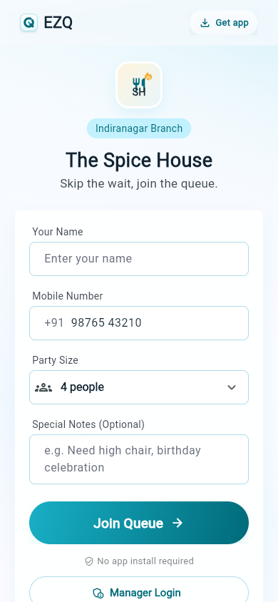
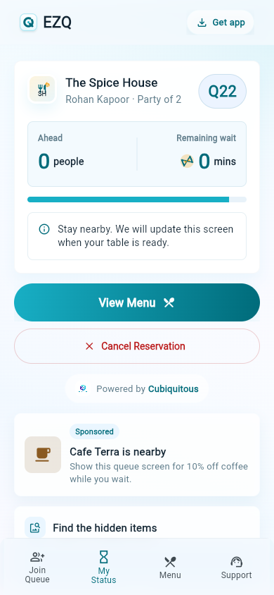
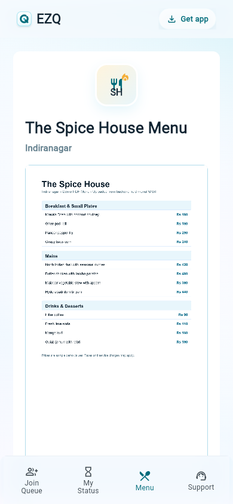
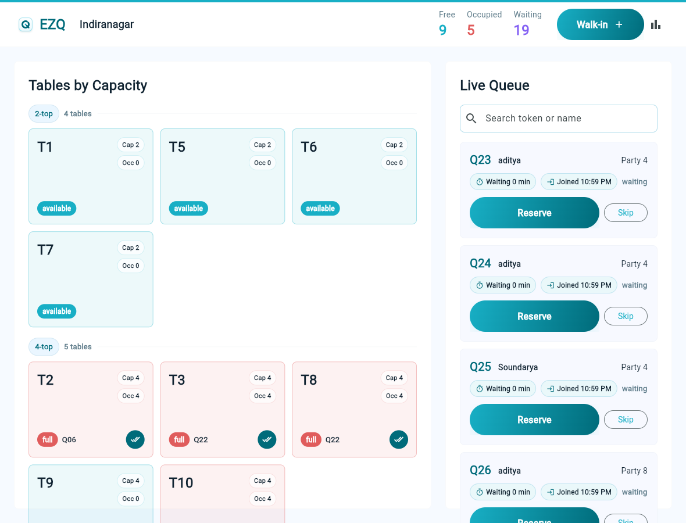

# EZQ UI Design Handout

Last updated: June 30, 2026

## 1. Product Experience

EZQ is a mobile-first restaurant queue management experience for two audiences:

- Customers: join a queue from a QR/web link, scan an in-app QR code on iOS/Android, track their place, see remaining wait, view the uploaded menu PDF, use support, and stay engaged while waiting.
- Managers: view table availability, seat the right table for a party, monitor wait duration, finish meals, undo recent seating mistakes, manage branch QR assets, and track table lifecycle timestamps.

The design direction is clean, calm, and iOS-inspired: high clarity, restrained surfaces, soft depth, compact spacing, large touch targets, and a small number of meaningful status colors.

## 2. Current UI Screenshots

These screenshots are captured from the deployed Firebase web app and should be used as the current visual reference for Figma, QA, and future UI work.

### Customer Join Queue

The customer entry screen is phone-first, QR-friendly, and optimized for fast queue submission without account creation.

### Customer Queue Status

The status screen shows token, party details, a reload-stable live count of waiting parties ahead, remaining wait, menu access, cancellation, powered-by branding, sponsored ad space, and the waiting puzzle module. Firestore updates remain live and the screen also refreshes its queue subscriptions every 15 seconds.

### Customer Menu

The menu screen is a PDF viewer surface backed by the restaurant-uploaded menu document. The pending state appears when no PDF is uploaded.

### Manager Dashboard

The manager dashboard uses a capacity-first table grid and a collapsible live queue panel. Queue cards show wait duration and joined time so managers understand how long each party has been waiting. The queue is an adaptive right-side split panel on usable desktop and landscape widths and a slide-over drawer on portrait and narrower screens.

## 3. Brand Direction

### Visual Personality

- Elegant, lightweight, and operational.
- Uses white, pale blue, mint, aqua, and teal as the core visual language.
- Avoids heavy decorative graphics in manager workflows.
- Uses motion and playful modules only in customer wait contexts.

### Logo System

- Product mark: compact rounded square with a queue-inspired Q mark.
- Parent brand: Cubiquitous appears in powered-by placements with the company logo.
- Admin header: EZQ product mark, branch name, live metrics, walk-in action, reports icon.
- Customer header: EZQ product mark, download app shortcut, glass-style top bar.

## 4. Color System

### Brand Palette

| Token | Hex | Use |
| --- | --- | --- |
| Cubiquitous Mint | `#CDFFD8` | Soft progress, gentle backgrounds |
| Cubiquitous Aqua | `#B0DCEB` | Borders, dividers, soft surfaces |
| Cubiquitous Sky | `#94B9FF` | Subtle progress and secondary accents |
| Tracura Purple | `#8461F4` | Waiting metric and tertiary accent |
| Tracura Cyan | `#81D8E5` | Secondary accent, light active surfaces |
| Primary Teal | `#18AFC5` | Primary action, available tables |
| Deep Teal | `#006B7A` | Strong text accent, icon emphasis |
| Navy Text | `#102331` | Primary text |
| Muted Text | `#607D8B` | Secondary text |
| Error Red | `#E05C5C` | Full/occupied pressure, destructive action |
| Success Green | `#24A148` | Positive states, future confirmations |
| Warning Orange | `#F59E0B` | Partial occupancy |

### Gradients

- Primary action gradient: `#18AFC5` to `#006B7A`.
- Brand gradient: `#8461F4` to `#81D8E5`.
- Progress gradient: `#CDFFD8`, `#81D8E5`, `#94B9FF`.

### Status Colors

| State | Color Rule |
| --- | --- |
| Available table | Primary teal |
| Partially occupied table | Warning orange |
| Fully occupied table | Error red |
| Legacy reserved table | Accent purple, compatibility only |
| Blocked table | Grey |
| Waiting queue count | Accent purple |
| Free table count | Primary teal |
| Occupied table count | Error red |

## 5. Typography

Primary font: Inter.

Use cases:

- Screen headings: 20 to 27 px, weight 800.
- Card titles and tokens: 18 to 24 px, weight 800.
- Primary button text: 16 to 19 px, weight 600 to 700.
- Field labels: 14 px, weight 500, slight positive tracking.
- Helper text and metadata: 11 to 13 px, weight 500 to 700.
- Token codes: JetBrains Mono where the code needs to scan as an identifier.

Do not use negative letter spacing. Do not scale font size with viewport width.

## 6. Shape, Spacing, and Surfaces

### Radius

- Standard cards: 8 px.
- Small media/ad cards: 10 to 12 px.
- Pills and primary buttons: 999 px.
- Brand mark container: proportional rounded square.

### Spacing

- Customer horizontal page padding: 14 px, with 6 px internal shell inset on compact phones.
- Customer cards: 20 px internal padding.
- Admin panels: 14 px compact, 24 px desktop.
- Admin table grid gaps: 8 px compact, 12 px desktop.
- Queue card spacing: 8 to 12 px between metadata and actions.

### Surface Rules

- Customer app uses soft layered surfaces and glass-like fixed chrome.
- Admin app uses plain white panels, compact table cards, and strong information density.
- Avoid cards inside cards.
- Avoid oversized hero layouts in operational screens.

## 7. Customer Web App

### Customer Shell

Purpose: consistent mobile web frame for QR-driven customer flows.

Key layout rules:

- Width caps at 390 px on larger screens.
- On compact phones, shell uses full screen width.
- Safe-area padding prevents overlap with iOS and Android status bars.
- Top bar is fixed, translucent, and blurred.
- Bottom navigation is fixed only after a queue entry exists.

Top bar elements:

- EZQ mark and wordmark.
- Download app button on the right.

Bottom tabs:

- Join Queue.
- My Status.
- Menu.
- Support.

The tabs must never route in a loop. Each tab should preserve the active queue entry when available.

### Join Queue Screen

Primary job: let a customer join the queue quickly without authentication.

Visible sections:

- Restaurant logo.
- Branch badge.
- Restaurant name and tagline.
- Join form card.
- Current wait animation card.
- Powered by Cubiquitous footer.

Form fields:

- Name.
- Mobile number with `+91` prefix.
- Party size picklist from 1 to 20.
- Special notes.

Primary action:

- `Join Queue`, full-width, large pill button.

Secondary action:

- `Manager Login`, outlined full-width pill button.

Behavior rules:

- Join button is disabled while submitting.
- Customer email login is not required.
- After successful join, route to queue status page.
- Once joined, the join flow should not let the same customer accidentally join again from the same active context.

### Customer Status Screen

Primary job: clearly show where the customer stands.

Core states:

- Waiting.
- Seated.
- Cancelled.
- Legacy reserved/table ready.

Waiting state content:

- Customer identity card.
- Token display.
- Queue position.
- Estimated remaining wait.
- Progress indicator.
- Status message.
- View menu action.
- Cancel reservation action.
- Powered by Cubiquitous.
- Sponsored ad slot.
- Hidden-object puzzle placeholder.

Wait display rules:

- Customer-facing text should show remaining minutes.
- Use an hourglass icon/animation treatment near estimated wait.
- Keep this card compact; avoid using excessive vertical space for small metadata.

Legacy table ready state:

- Make the readiness message prominent.
- Show assigned table number when available.
- Keep menu and support access available.

Seated state:

- Confirm that the guest is seated.
- Preserve menu access.

### Menu Screen

Primary job: show restaurant-uploaded menu PDF.

Rules:

- Menu is a scrollable PDF page.
- Backend controls the uploaded PDF URL.
- If no PDF is present, show a clean pending state with a PDF icon.
- The menu screen must respect safe areas and customer shell width.

### Sponsored Ad Slot

Purpose: use wait time for lightweight local promotion.

Current design:

- Full-width card.
- Small icon/thumbnail on the left.
- `Sponsored` pill.
- Title and two-line description.

Future behavior:

- Backend can rotate ads by branch, campaign, or time window.
- Ad content should remain non-blocking and never interrupt queue status.

### Find-the-Difference Puzzle

Purpose: customer engagement while waiting.

Current design:

- Card titled `Find the differences`.
- Randomly selected backend-sourced puzzle image URL.
- 4:3 image frame.
- Pending state with upload placeholder.

Future behavior:

- Restaurant or admin backend can upload or curate puzzle image sets.
- Optional future answer key or hint interaction can be added below the image.

## 8. Manager Admin App

### Admin Dashboard Layout

Primary job: help manager seat parties quickly and understand capacity.

Wide desktop and usable landscape layout:

- Top bar.
- Left panel: Tables by Capacity.
- Adaptive right panel: collapsible Live Queue.
- Closing the Live Queue immediately expands Tables by Capacity across all available dashboard space.

Portrait and narrow layout:

- Top bar wraps into two rows.
- Metrics and walk-in action remain visible.
- Tables remain full width.
- Live Queue opens as a full-height right-side drawer with backdrop and internal scrolling.
- A 44 x 44 edge handle opens or closes the queue; drawer mode also supports Escape and backdrop dismissal.
- Queue actions become full-width where needed.

Top bar:

- EZQ logo.
- Branch name.
- Free count.
- Occupied count.
- Waiting count.
- Walk-in action.
- QR management icon.
- Daily summary icon.

### Tables by Capacity

Purpose: manager should choose tables by exact capacity with minimum scanning.

Grouping:

- Tables are sorted by capacity.
- Each group header shows `{capacity}-top` and number of tables.
- Within group, tables sort by sort order and table number.

Table card content:

- Table number.
- Capacity pill: `Cap X`.
- Occupied pill: `Occ X`.
- Status pill.
- Current token when occupied.
- Finish meal icon button when occupied.

Table statuses:

- `available`: empty table.
- `partial`: occupied below capacity.
- `full`: occupied at capacity.
- `reserved`: legacy compatibility state only; the live seating flow moves directly to occupied.
- `blocked`: non-service table.

Cleaning is intentionally removed from the workflow. Legacy `cleaning` data should be treated as available.

Table color rules:

- Available tables use the light blue/aqua treatment.
- Partially occupied tables use light lavender so they are distinct from next-best-fit yellow highlights.
- Fully occupied tables use red.
- Best-fit highlights use green.
- Next-best-fit highlights use yellow.

### Live Queue

Purpose: manager should understand who is waiting, how long they have waited, and which party to reserve next.

Responsive behavior:

- The Live Queue is collapsible at every supported size and orientation.
- Landscape widths of at least 900 px use the split-panel presentation; widths of at least 1200 px use it regardless of orientation.
- Narrower mobile and tablet views use the slide-over drawer so table cards are never compressed into an unusable desktop-style column.
- Closing either presentation removes its reserved layout space so the tables reflow across the complete dashboard.
- The open/closed preference is stored per restaurant branch.
- The same queue widget stays mounted while closing or rotating, preserving search input, expanded-card state, selections, recommendations, and scroll position without creating another queue subscription.
- Motion follows the device reduced-motion preference.

Queue card content:

- Token code.
- Customer name.
- Party size.
- Wait duration pill: `Waiting X min`.
- Joined time pill: `Joined h:mm AM/PM`.
- Status text.
- Reserve action.
- Skip action.

Reserve behavior:

- Manager clicks `Reserve`.
- App asks for table selection from a picklist of fitting tables.
- Best-fit and next-best-fit recommendations are color coded.
- Free-text table entry is avoided to reduce manual errors.
- Once selected, the queue entry becomes seated and the table becomes occupied directly.
- Customer status updates to the seated/table-assigned flow.
- Recommendation hand icons are actionable and assign the recommended table directly.
- Recent seating mistakes can be undone from popup feedback and from the table tile for a short recovery window.

Recommendation behavior:

- Table-side clicks highlight the best queue parties for that table and scroll the live queue to the best-fit party.
- Queue-side clicks highlight only the smallest fitting table set first.
- Multi-table recommendations are used only when the party is larger than every currently available single table.
- Multi-table best fit highlights every exact-capacity two-table combination available on each floor.
- Multi-table next best fit highlights every higher-capacity two-table combination available on each floor.
- Multi-table combinations use only completely available tables; partially occupied tables are excluded.
- Selecting a multi-table recommendation atomically assigns and occupies every table in the combination, while undo and finish-meal actions release the full combination together.
- Parties that accept shared seating may be recommended to compatible partially occupied tables or empty tables.
- Parties that do not accept shared seating should be recommended only to empty tables.
- When a non-sharing party is seated, the assigned table is treated as full even if physical seats remain.
- Queue cards show a compact `Share` tag when a party accepts shared seating.

Skip behavior:

- Manager can skip the customer when needed.
- Skipped entries should leave the active waiting list.

Meal finished behavior:

- Manager clicks finish meal on the occupied table tile.
- Manager enters or confirms how many people finished the meal.
- Table becomes available.
- The end time for the previous customer becomes the start time for the next customer for that table where applicable.

### Walk-In Dialog

Purpose: quick manual queue creation for guests who arrive without QR flow.

Fields:

- Name.
- Phone, optional, numeric only when entered.
- Party size picker matching the customer flow.
- Seating preference with non-shared as the default and a visible share checkbox/card.
- Live shared and non-shared wait estimates.
- Notes.

Behavior:

- Add to queue validates optional phone input as numeric and 10 digits when provided.
- Walk-ins are created with queue preferences so table recommendations work the same way as customer-created queue entries.

### QR Management

Purpose: let branch staff and operators access the QR assets that route customers into the correct queue.

Entry point:

- QR icon in the admin top bar.
- Manage QR action on the completed onboarding summary.

Current capabilities:

- Shows branch QR code preview.
- Keeps the QR preview within the available desktop and landscape viewport.
- Shows queue URL for the selected branch.
- Copies the queue URL.
- Downloads PNG and SVG QR assets.
- Shares the queue link through the browser share/mail flow.
- Opens a print-friendly QR view.
- Uses bundled QR assets for demo restaurants and branches.

Rules:

- QR management is read/action focused in the app.
- Regenerating or mutating QR metadata should stay behind an admin-safe backend path before it is exposed.
- QR asset paths are configured as Flutter assets and exported through web-safe file actions.

### Reports

Purpose: daily operating view.

Entry point:

- Bar chart icon in admin top bar.

Current reporting concepts:

- Total joined.
- Total seated.
- Waiting now.
- Skipped.
- Cancelled.
- Peak queue size.

## 9. Component Inventory

### BrandMark

- Rounded square mark.
- White to pale-blue fill.
- Deep teal Q stroke.
- Primary teal center dot.
- Subtle shadow.

### EzqButton

- Full-width primary action.
- Pill shape.
- Primary teal to deep teal gradient.
- White text.
- Optional trailing icon.
- Disabled state uses muted grey gradient and reduced opacity.
- Destructive variant is outlined red.

### EzqTextField

- Label above field.
- White filled input.
- 8 px radius.
- Aqua border.
- Teal focused border.
- 15 px vertical padding.

### StatusBadge

- Pill badge.
- Used for branch labels and small state markers.
- Keep text short and scannable.

### QueueMetaPill

- Used in manager queue cards.
- Soft surface background.
- Icon plus compact text.
- Shows wait duration and joined time.

### TableMetricPill

- Used in table tiles.
- White translucent background.
- Shows `Cap` and `Occ`.
- Border color follows table status.

## 10. Responsive Design Rules

Breakpoints:

- Compact: width under 700 px.
- Tablet: 700 px to 1099 px.
- Desktop: 1100 px and above.

Customer app:

- Always optimized for phone-first.
- Max content width is 390 px.
- Full-screen width allowed under 430 px.
- Safe areas must be honored for iOS/Android status and navigation bars.

Admin app:

- Desktop uses side-by-side panels.
- Tablet keeps dense layout but reduces panel and card spacing.
- Phone stacks panels and turns queue actions into vertical controls.
- No fixed-width component should overflow the viewport.

## 11. Accessibility and Interaction

Minimum expectations:

- All touch targets should be at least 44 px high.
- Icon-only buttons need tooltips or semantic labels.
- Status should not rely on color alone; labels must be visible.
- Text must not overlap on iPhone, Android phones, iPad, or Android tablets.
- Buttons must provide disabled states where actions are unavailable.
- Inputs must have visible labels, not placeholder-only descriptions.

Current semantic labels:

- Powered by Cubiquitous.
- Sponsored ad.
- Download the EZQ app.

## 12. Figma Alignment Notes

The implementation should stay close to the Figma direction:

- Rounded but restrained cards.
- Apple-style compact spacing.
- Minimal text explanations inside the app.
- Productive, scan-friendly admin screens.
- Customer pages should feel polished and warm without becoming a marketing landing page.

Recommended Figma component set:

- Brand header.
- Customer shell.
- Bottom tab bar.
- Join queue form card.
- Party size picker.
- Status token card.
- Menu PDF state.
- Sponsored ad card.
- Hidden-object placeholder.
- Admin top bar.
- Top metric.
- Capacity group header.
- Table tile.
- Queue entry card.
- Reserve table picker dialog.
- Walk-in dialog.

## 13. Current Routes and Screen Map

Customer:

- `/customer/:restaurantBranchId`
- `/customer/:restaurantBranchId/status/:queueEntryId`
- `/customer/:restaurantBranchId/ready/:queueEntryId`
- `/customer/:restaurantBranchId/seated/:queueEntryId`
- `/customer/:restaurantBranchId/menu?queueEntryId=:queueEntryId`
- `/customer/:restaurantBranchId/support`
- `/customer/install`
- `/app/login`
- `/app/profile`
- `/app/home`
- `/app/nearby`
- `/app/scan`

Manager:

- `/admin/login`
- `/admin/:restaurantBranchId/register/onboarding`
- `/admin/:restaurantBranchId/dashboard`
- `/admin/:restaurantBranchId/reports`

Completed onboarding route behavior:

- Normal manager login continues directly to the branch dashboard.
- Explicitly opening the branch onboarding URL after provisioning shows only the locked completion summary (Screen 4).
- Screen 4 initializes after the first widget frame and reconstructs its summary from fresh Firestore admin and branch documents, independent of onboarding drafts, provider cache, navigation history, or prior in-memory state.
- The completion summary exposes Setup Summary, Provisioning Checklist, Download Setup Summary, Manage QR, and Go to Dashboard without rebuilding Screens 1-3.
- Failed Firestore loads replace the loading state with an error page offering Retry and Go to Dashboard, so the route cannot remain on an infinite spinner.

Onboarding data and validation behavior:

- `admins/{uid}.restaurantBranchId` resolves the canonical `restaurantBranches/{restaurantBranchId}` document used by Step 1; restaurant name, branch name, area, and address come from the canonical branch document rather than an onboarding draft.
- Restoring a draft can recover wizard progress and floor/table configuration, but it cannot overwrite canonical branch identity or administrator profile fields.
- Step 1 Continue is enabled only when the branch mapping, administrator name, email, phone, restaurant name, branch name, area, and address all pass validation.
- Missing canonical values are identified by their Firestore document and field instead of being rendered as `Not specified`.
- `onboardingCompleted` and `provisioningStatus` are written atomically. A completed provisioning status is valid only with `onboardingCompleted: true`; inconsistent persisted states stop restoration and surface an actionable error.

## 14. Design Decisions Already Made

- Customer web app does not require email authentication.
- Manager login is email/password based.
- Reserve flow uses table picklist, not free-text input.
- Reserve seats the party immediately, sets the table to occupied, and records assignment timestamps.
- Non-sharing seated parties consume the full assigned table for availability and recommendation purposes, while completion reporting keeps the actual party size.
- Mark seated step is removed.
- Active table statuses are `available`, `occupied`, and `blocked`; `blocked` represents staff offline-reserved/disabled tables, `reserved` remains legacy-compatible, and `cleaning` maps to available.
- Table cards show capacity and occupied count.
- Tables are sorted and grouped by capacity.
- Finishing a meal captures completed party size and records table cycle timestamps.
- Queue cards show how long the party has waited and what time they joined.
- Queue recommendations should prefer the smallest fitting table and use green for best fit, yellow for next best fit. Oversized parties expose all same-floor, two-table exact and higher-capacity combinations using only fully available tables.
- Multi-table recommendation actions store the combined display label plus `assignedTableIds` and `assignedTableNumbers` on the queue entry; singular assignment fields remain populated for backward compatibility.
- Recent seating assignments should be undoable for a short recovery window.
- Admin toasts are popup-style feedback, not bottom snackbars.
- Walk-in queue entries support seating preference and live ETA context.
- Branch QR management is available from the admin top bar.
- Completed onboarding remains available as a read-only Screen 4 summary only when its branch URL is opened explicitly; login still routes completed managers directly to the dashboard.
- Admin login, dashboard, and reports routes use the same canonical onboarding readiness validation so a branch cannot be rejected at login and accepted by a direct route.
- Operational legacy branches reconstruct deterministic queue URLs and missing capacity types in memory after their persisted floors, tables, settings equivalents, and completion state pass strict validation.
- Restaurant onboarding completes the admin, branch, floors, tables, settings, and QR configuration in one atomic Firestore batch with deterministic document IDs.
- Failed onboarding can be retried safely without duplicate or orphan floors, tables, settings, or QR metadata.
- Completed onboarding deep links restore a read-only setup summary from Firestore; they never reopen editable wizard steps.
- Customer status includes ad space and hidden-object puzzle placeholder.
- Admin and mobile customer auth both show the OTP verification step. For MVP/TestFlight validation the app accepts `123456`; the retained Firebase SMS verification path can be restored with `--dart-define=USE_REAL_FIREBASE_OTP=true`.
- Temporary admin authentication covers every configured demo restaurant, falls back to canonical backend phone resolution when no local compatibility entry exists, and verifies the authenticated UID, phone, and restaurant branch against the canonical `admins/{uid}` document before routing.
- A customer with a `waiting`, `reserved`, or `on_the_way` queue entry cannot join another restaurant queue. Cancelling or being seated releases the customer to join again.
- The native QR scanner shows explicit camera-denied and camera-unavailable states with retry, Open Settings, and manual-code fallback actions on both iOS and Android.
- Nearby restaurants distinguishes location services off, permission denied, and permission permanently denied. Customers can retry, open the appropriate Settings page, or continue using the demo location without a dead end.
- Native QR joins and nearby-list joins require a fresh location check before the join form opens; customers must be within 2 km of the restaurant branch GPS point.
- The signed-in app home restores the customer's current visit, follows queue changes live through seating, and offers direct view and cancellation actions while waiting.
- Mobile app first-time customer profile captures first and last name and stores the signed-in customer profile.
- Signed-in mobile customers can reopen their account profile from app home and update their first and last name.
- Mobile app `/app/scan` opens the Camera Lens QR scanner and resolves direct customer links or active branch QR slugs.
- Cubiquitous branding appears in powered-by placement.

## 15. Feature List Built So Far

Customer features:

- Guest join queue from restaurant branch URL.
- iOS/Android phone authentication entry at `/app/login`.
- First-time mobile profile capture for first name and last name.
- Editable signed-in mobile profile at `/app/account`.
- Customer mobile app home/nearby restaurant flow after login.
- Camera Lens QR scanner at `/app/scan` using device camera.
- QR scanner fallback for manually entering an EZQ link or QR code.
- QR route resolver for canonical `/customer/:restaurantBranchId` links, legacy two-segment links, and active branch `qrSlug` values.
- Native join-location gate for scanned QR links, manual QR entries, and nearby restaurant join buttons.
- Customer join form with name, mobile number, party size, and optional notes.
- Mobile join form can prepopulate known signed-in customer name and phone number.
- Exact party size selection from 1 to 20.
- Seating preference selection for shared seating versus empty-table-only waiting.
- Live shared and non-shared wait estimates in the mobile customer join flow.
- Live customer status screen with token, party size, waiting parties ahead, and remaining wait.
- Customer seated/table-assigned state after manager seating.
- Customer cancellation action while waiting.
- Single-active-queue protection for signed-in mobile customers until the user cancels or the visit is completed.
- Live active-visit card on the signed-in app home with restaurant branch, token, live ahead count, estimated wait, seated table, resume, and cancellation actions.
- Uploaded menu PDF viewing from branch configuration.
- Customer support screen.
- Customer shell with EZQ header, app install shortcut, and bottom tabs after queue entry exists.
- Powered by Cubiquitous branding.
- Sponsored ad slot on the waiting status screen.
- Find-the-difference waiting-game image with backend-driven random image URLs.

Manager features:

- Firebase email/password manager login.
- One-time restaurant onboarding with a persistent, locked completion summary at the explicit branch onboarding URL.
- Refresh- and deep-link-safe completed onboarding restoration from persisted Firestore data, with no dependency on onboarding drafts or provider cache.
- Completed onboarding summary actions for downloading setup details, shared QR management, and dashboard navigation.
- Recoverable onboarding-load failure state with Retry and Go to Dashboard actions.
- Canonical Step 1 restoration from the mapped admin and branch documents, with field-specific missing-data warnings and validation diagnostics.
- Atomic onboarding completion state across admin and branch records, guarded by Firestore rules.
- Branch dashboard route for a selected `restaurantBranchId`.
- Live table grid backed by Firestore streams.
- Tables grouped and sorted by capacity.
- Multiple floors within one capacity stay side by side, with a visible horizontal scrollbar on narrow mobile and tablet layouts.
- Table tiles showing table number, status, capacity, occupied count, and token when linked.
- Live queue panel backed by Firestore streams.
- Collapsible Live Queue with adaptive desktop/tablet landscape split-panel and mobile/tablet drawer presentations.
- Full-width table expansion while the Live Queue is closed, with per-branch open/closed preference persistence.
- Queue search, selection, recommendation, and scroll state preservation across collapse and orientation changes.
- Current-business-date queue cards with unique daily tokens, customer, party size, wait duration, joined time, and actions.
- Queue cards showing compact share preference tag for parties open to shared seating.
- Optimized queue recommendations with best-fit and next-best-fit table suggestions.
- Same-floor multi-table recommendations for parties larger than the maximum available single-table capacity.
- Reserve action that opens a fitting table picker with color-coded best and next-best options.
- Recommendation buttons focus and scroll to the highlighted best-fit or next-best table result; seating remains behind Reserve confirmation.
- Queue-card click highlights fitting tables and scrolls to the relevant table group.
- Table-tile click highlights recommended queue parties and scrolls to the best-fit queue card.
- Direct seating flow that sets queue entry to seated and table to occupied.
- Non-sharing seating flow that marks the assigned table full even when spare seats physically remain.
- Undo seating action from popup feedback and the top-right of recently seated table tiles.
- Skip action for waiting queue entries.
- Finish meal action on occupied tables.
- Completed party size capture when finishing a meal.
- Table lifecycle timestamp recording for cycle start and cycle end.
- Walk-in dialog for manually adding a queue entry with party size picker, optional validated phone, notes, share preference, and live ETA context.
- Offline-reserve mode that lets staff select fully available tables and mark them blocked so they are excluded from queue seating.
- Enable-table mode that lets staff select offline reserved/blocked tables and return them to the available pool.
- Clickable top metrics for free, occupied, and waiting filters.
- Popup-style admin feedback toasts.
- QR management dialog with preview, branch queue URL, copy, share, print, and PNG/SVG download actions.
- Daily summary/report entry point from dashboard.

Platform and backend features:

- Firebase Hosting configured for Flutter web.
- Firebase Hosting configured with no-cache headers for app shell files and full hosting responses to reduce stale deployments.
- Firestore data model for restaurants, branches, tables, queue entries, and daily counters.
- Firebase Auth integrated for manager accounts.
- Firebase Auth phone sign-in integrated for mobile customer accounts.
- Firestore rules and indexes maintained in the repository.
- Firestore rules allow active branch reads for QR resolution and signed-in customers to manage only their own customer profile.
- Active restaurant branch documents store GPS coordinates used by the native nearby list and 2 km join-vicinity gate.
- Seed script for demo restaurant data.
- Queue seeding script for realistic table occupancy and waiting list scenarios.
- Branch-scoped queue-clear fail-safe script with dry-run, audit trail, no queue-entry deletion, and table release/reset behavior.
- QR asset generation and branch identity scripts for branch QR metadata.
- Bundled QR assets for demo restaurants.
- Firestore smoke test script for core queue/table flows.
- Cloud Functions source present for production hardening path.
- Flutter web build configured with Firebase runtime define.
- iOS and Android camera/location permissions configured for the native customer app.

## 16. Functional Requirements Covered

Customer flow:

- The system shall allow a customer to join a restaurant branch queue without creating an account.
- The system shall allow iOS/Android app customers to sign in with phone authentication.
- The system shall capture first and last name for first-time mobile app customers.
- The system shall allow signed-in mobile app customers to update their first and last name from app home.
- The system shall allow app customers to scan an EZQ QR code using the device camera.
- The system shall resolve scanned direct links and active branch QR slugs to the correct customer queue route.
- The system shall request location permission before opening the native join form from a scanned QR/manual QR/nearby-list join and block the join if the customer is outside 2 km of the restaurant branch.
- The system shall collect customer name, phone number, exact party size, and optional notes.
- The system shall prepopulate known signed-in customer name and phone number where available.
- The system shall collect seating preference for shared seating or empty-table-only waiting.
- The system shall show shared and non-shared wait estimates where live data is available.
- The system shall create a queue entry with waiting status and a token code.
- The system shall prevent a signed-in mobile customer from joining another restaurant queue while they have an active queue or seated visit.
- The system shall restore a signed-in customer's current visit on app home after the app is closed and reopened.
- The system shall update the app-home visit card live from waiting through seating, show the same live ahead-count pattern used by the customer status screen, and allow cancellation before seating.
- The system shall show the customer a reload-stable live FIFO count of waiting parties ahead, refresh queue subscriptions every 15 seconds, and show the estimated remaining wait.
- The system shall keep the active queue entry available across status, menu, and support navigation.
- The system shall allow a waiting customer to cancel their queue entry.
- The system shall show the assigned table once the manager seats the party.
- The system shall show the restaurant menu PDF when the branch has a menu URL configured.
- The system shall show a pending menu state when no menu PDF is configured.
- The system shall display non-blocking waiting engagement content below the core status information.

Manager flow:

- The system shall require manager login before accessing the admin dashboard.
- The system shall route completed managers directly to the dashboard after login.
- The system shall render only the locked completion summary when a completed branch onboarding URL is opened explicitly.
- The system shall initialize onboarding data after widget construction and shall not mutate Riverpod providers during `initState`, `didChangeDependencies`, or `build`.
- The system shall reconstruct completed Screen 4 from fresh persisted Firestore admin and branch data after refresh, deep link, new browser session, or logout/login.
- The system shall prevent completed onboarding summaries from reopening restaurant details, floor/table configuration, or review steps.
- The system shall reuse the dashboard QR-management dialog from the completed onboarding summary.
- The system shall replace failed onboarding Firestore loads with an error page containing Retry and Go to Dashboard instead of leaving an infinite loading indicator.
- The system shall source Step 1 identity from `restaurantBranches/{restaurantBranchId}` and administrator details from `admins/{uid}` after resolving the signed-in administrator's branch mapping.
- The system shall restore draft progress and table configuration without allowing draft identity fields to replace canonical branch or administrator values.
- The system shall enable Step 1 Continue only when branch mapping, administrator name, email, phone, restaurant name, branch name, area, and address are valid.
- The system shall name the exact Firestore document and field when required onboarding data is missing instead of displaying `Not specified`.
- The system shall keep admin and branch `onboardingCompleted` flags synchronized with branch `provisioningStatus`, and shall reject any persisted completed/incomplete mismatch.
- The system shall preserve strict completed-onboarding validation while reconstructing deterministic legacy metadata only when the persisted operational floor, table, settings-equivalent, admin, and branch data is internally consistent.
- The system shall use one canonical admin-branch readiness result for login, dashboard, onboarding, and reports routing.
- The system shall show live waiting queue entries for the selected branch.
- The system shall allow the Live Queue to be collapsed and reopened by touch, mouse, or keyboard on desktop, tablet, and mobile layouts.
- The system shall expand the table dashboard into all released space when the Live Queue is closed.
- The system shall use an adaptive split panel at usable wide widths and a right-side drawer on portrait or narrow viewports without device-name detection.
- The system shall preserve Live Queue state and its per-branch open/closed preference across layout and orientation changes.
- The system shall show live table availability for the selected branch.
- The system shall group tables by capacity and sort them for fast scanning.
- The system shall recommend best-fit and next-best-fit tables for each waiting party.
- The system shall recommend multiple tables only when the waiting party exceeds the maximum capacity of every available single table.
- The system shall keep every recommended table combination on one floor, restrict combinations to exactly two tables, show all exact pairs as best fit, and show all higher-capacity pairs as next best fit.
- The system shall exclude partially occupied tables from multi-table combination recommendations.
- The system shall atomically occupy every table selected in a multi-table recommendation and release the full combination on undo or meal completion.
- The system shall recommend partially occupied tables only when the waiting party accepts shared seating and the table has enough spare seats.
- The system shall allow a manager to reserve a waiting party by selecting a fitting table from recommendations or the table picker.
- The system shall avoid free-text table assignment in the reserve flow.
- The system shall immediately mark the selected queue entry as seated and every selected table as occupied.
- The system shall treat tables assigned to a non-sharing party as fully occupied for remaining-seat display and future queue recommendations.
- The system shall allow a recent seating assignment to be undone during a short recovery window.
- The system shall store assigned table details on the queue entry.
- The system shall store current queue linkage on the occupied table.
- The system shall allow a manager to skip a waiting party.
- The system shall allow a manager to finish a meal from an occupied table.
- The system shall capture completed party size when a meal is finished.
- The system shall return the table to available after the meal is finished.
- The system shall mark the queue entry completed after the meal is finished.
- The system shall record table cycle timestamps for reporting.
- The system shall allow managers to create walk-in queue entries with party size, optional phone, notes, and share preference.
- The system shall validate optional walk-in phone input when present.
- The system shall allow managers to select fully available tables and mark them offline reserved/disabled.
- The system shall allow managers to select offline reserved/disabled tables and enable them for queue seating again.
- The system shall exclude offline reserved/disabled tables from queue seating and table recommendations.
- The system shall show offline reserved/disabled tables as grey tiles with a disabled indicator.
- The system shall expose QR management actions for branch QR preview, queue URL copy, QR download, share, and print.

Operational requirements:

- The system shall treat active table statuses as `available`, `occupied`, and `blocked`.
- The system shall treat `blocked` tables as unavailable for queue assignment and customer wait estimation.
- The system shall keep `reserved` compatible as a legacy/transitional state.
- The system shall treat legacy `cleaning` table data as available.
- The system shall keep customer-facing flows safe-area aware on mobile devices.
- The system shall keep manager dashboard layouts usable across phone, tablet, and desktop widths.
- The system shall preserve QR asset download/print behavior in Flutter web builds.
- The system shall avoid stale Firebase Hosting app-shell caching after deployments.
- The system shall provide an ops-only fail-safe to clear a branch queue without deleting queue history: waiting/reserved/on-the-way entries are cancelled, seated entries are completed, affected tables are released, and an audit record is written.
- The system shall keep Cloud Functions source aligned with app behavior for future backend hardening.

## 17. User Stories

Customer user stories:

- As a walk-in customer, I want to scan a QR link and join the queue without creating an account so I can start waiting quickly.
- As a mobile app customer, I want to scan a restaurant QR with my camera so I can open the correct branch queue without typing.
- As a restaurant operator, I want mobile customers to be near the restaurant before joining so remote or accidental queue entries are reduced.
- As a mobile app customer, I want my known name and phone to prefill so joining a queue is fast.
- As a mobile app customer, I want to update my saved name so restaurants see the correct queue identity.
- As a mobile app customer, I want the app to stop me from joining multiple active restaurant queues so I do not create duplicate waits.
- As a mobile app customer, I want my active queue restored on the home screen so I can resume tracking it after reopening the app.
- As a mobile app customer, I want to view or cancel my current queue directly from home so I can manage my visit quickly.
- As a customer, I want to enter my party size exactly so the restaurant can assign a suitable table.
- As a customer, I want to choose whether I am willing to share a table so my wait estimate and table assignment match my preference.
- As a customer, I want to see shared and non-shared wait estimates so I can make an informed seating choice.
- As a customer, I want to see my token and queue position so I know my place in line.
- As a customer, I want to see my remaining wait time so I can decide whether to stay nearby.
- As a customer, I want to open the menu while waiting so I can decide what to order before being seated.
- As a customer, I want to cancel my queue entry if my plans change so the restaurant queue stays accurate.
- As a customer, I want to see my assigned table when I am seated so I know where to go.
- As a customer, I want support access during the wait so I can contact staff if I need help.
- As a waiting customer, I want light engagement content so the waiting screen feels useful rather than empty.

Manager user stories:

- As a manager, I want to log in securely so only staff can manage the queue.
- As a manager, I want login to return me directly to my dashboard after onboarding is complete.
- As a manager, I want to revisit the completed onboarding summary by its explicit URL without being able to rerun setup.
- As a manager, I want a completed setup summary to survive refreshes, deep links, and new sessions without relying on an old onboarding draft.
- As a manager, I want the onboarding summary to offer the same QR management actions as the dashboard.
- As a manager, I want a failed setup-summary load to offer Retry and dashboard access instead of spinning indefinitely.
- As a manager, I want Step 1 to restore canonical restaurant, branch, area, address, and administrator details without a stale draft erasing them.
- As a manager, I want Continue to explain every invalid required field so I can distinguish missing Firestore data from an application defect.
- As a manager, I want to see all waiting parties live so I can decide who to seat next.
- As a manager, I want to see tables grouped by capacity so I can quickly find a good fit.
- As a manager, I want best-fit and next-best-fit suggestions so I can seat parties quickly without wasting capacity.
- As a manager, I want to tuck away and reopen the Live Queue so I can use the complete dashboard for tables without losing my queue context.
- As a manager, I want oversized parties matched to the fewest same-floor tables so large groups can be planned without splitting across floors.
- As a manager, I want shared-seating parties matched to compatible partial tables so I can improve table utilization.
- As a manager, I want non-sharing parties matched only to empty tables so I respect customer preference.
- As a manager, I want a non-sharing party's assigned table to show as full so staff do not add another party to it accidentally.
- As a manager, I want to assign a party from a list of fitting tables so I avoid table-number mistakes.
- As a manager, I want recommendation buttons to focus and scroll to the suggested table before I confirm seating so I can verify the choice quickly.
- As a manager, I want table and queue clicks to scroll to the highlighted recommendation so I do not lose context.
- As a manager, I want the reserve action to seat the party immediately so I do not need a second mark-seated step.
- As a manager, I want to undo a recent reservation if I make a mistake so I can recover without manual data fixes.
- As a manager, I want occupied table tiles to show token and party occupancy so I can understand current floor usage.
- As a manager, I want to finish a meal from the table tile so I can free the table for the next party.
- As a manager, I want to record how many guests finished so reports match actual service.
- As a manager, I want to skip a waiting customer so the live queue stays actionable when someone is unavailable.
- As a manager, I want dashboard metrics for free, occupied, and waiting counts so I can monitor pressure at a glance.
- As a manager, I want a walk-in dialog with party size picker, optional validated phone, and share preference so staff can add guests who did not use the QR flow.
- As a manager, I want to mark fully available tables as offline reserved so walk-in or phone reservations do not get assigned to the live queue.
- As a manager, I want to enable offline reserved tables again once they are ready for EZQ queue assignment.
- As a manager, I want QR management actions in the dashboard so I can copy, download, share, or print the branch QR code.

Admin and operator user stories:

- As a restaurant admin, I want onboarding Retry to be safe after a network or provisioning failure so setup never creates duplicate operational data.
- As a restaurant admin, I want the completed setup summary to restore after refresh, login, or a direct link so I can verify the persisted configuration at any time.
- As an operator, I want seeded demo data so I can test the app without manually building a restaurant branch.
- As an operator, I want realistic queue seed data so I can test table recommendation behavior under pressure.
- As an operator, I want an audited fail-safe to clear a branch queue during demos, closing, or recovery scenarios so staff can reset operations without losing queue history.
- As an operator, I want smoke tests for Firestore flows so I can verify queue and table behavior after changes.
- As an operator, I want bundled QR assets and branch QR metadata so branch onboarding can be demonstrated end to end.
- As a product owner, I want menu and waiting-game media fields in branch configuration so content can be managed per location.
- As a product owner, I want lifecycle timestamps stored so future reports can measure seating and table turnover.

## 18. Open UI Backlog

- Add backend upload UI for menu PDF.
- Add backend upload UI for find-the-difference puzzle image sets.
- Add empty states for no waiting queue and no available tables.
- Add loading skeletons for admin dashboard panels.
- Add no-show handling if the party does not arrive after being called.
- Add visual design handoff screens in Figma for the latest admin dashboard.
- Add post-sale mobile push notifications for table-ready, cancelled, skipped, and no-show queue updates.
- Add a customer notification preferences screen after MVP v1.
- Move QR metadata regeneration behind an admin-safe backend function before exposing it in production UI.
